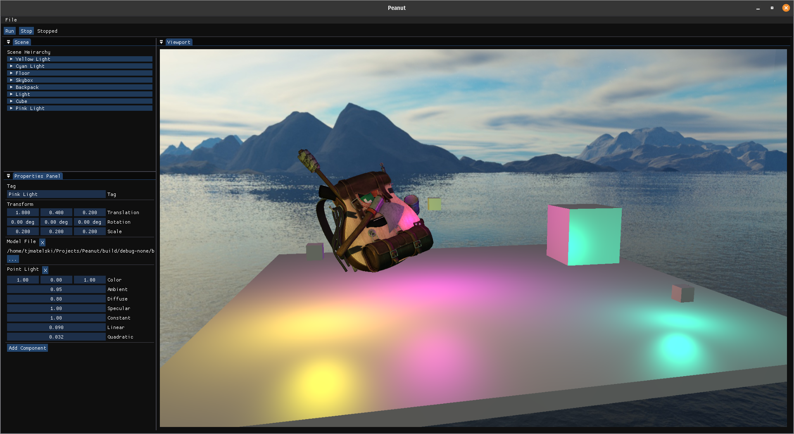

# Peanut
Game engine written in C++ for fun and educational purposes.

## Building

Peanut is built using the CMake build manager and has only been tested on Ubuntu based linux distros. The only dependancy not inlcuded as a submodule is the OpenGL library for your distribution. That will need to be installed with the package manager.

- Clone the repo: `git clone https://github.com/tjmatelski/Peanut.git`
- Update submodules: `git submodule init; git submodule update`
- Generate build files with CMake: `cmake -B <build dir> -S <source dir>`
- Build with CMake: `cmake --build <build dir>`

## Resources

- [The Cherno Game Engine Series](https://www.youtube.com/watch?v=JxIZbV_XjAs&list=PLlrATfBNZ98dC-V-N3m0Go4deliWHPFwT)
- [Learn OpenGL](https://learnopengl.com/)
- [Game Programming Patterns](https://gameprogrammingpatterns.com/contents.html)